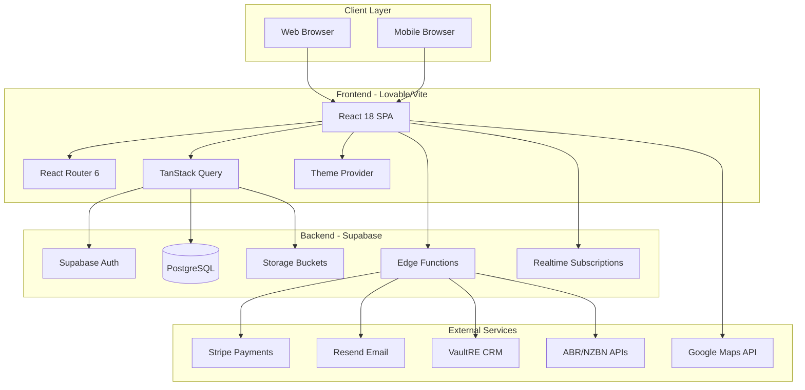
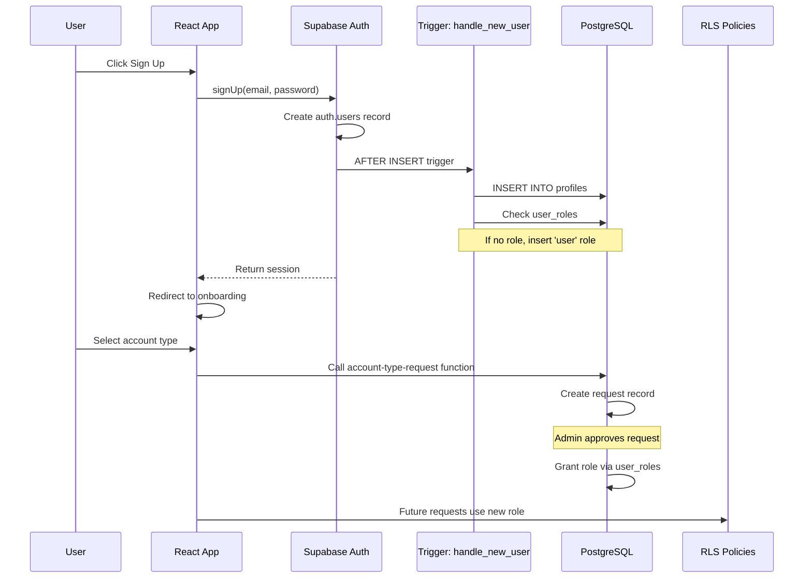
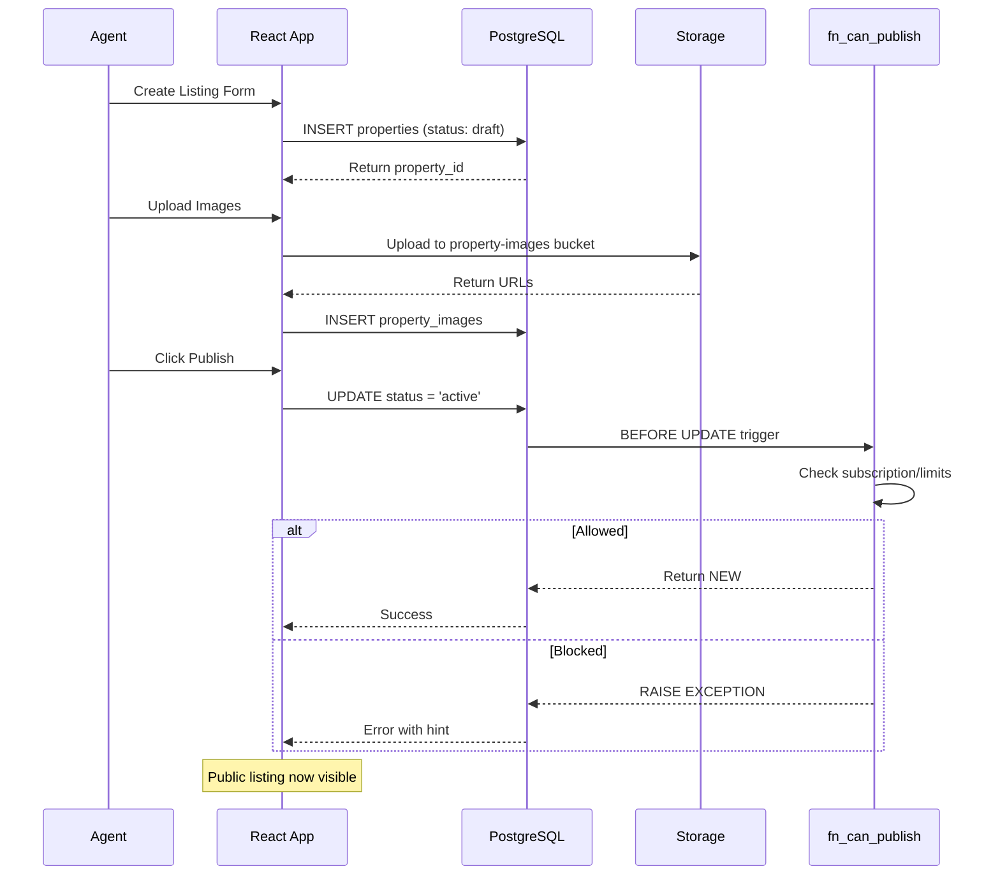
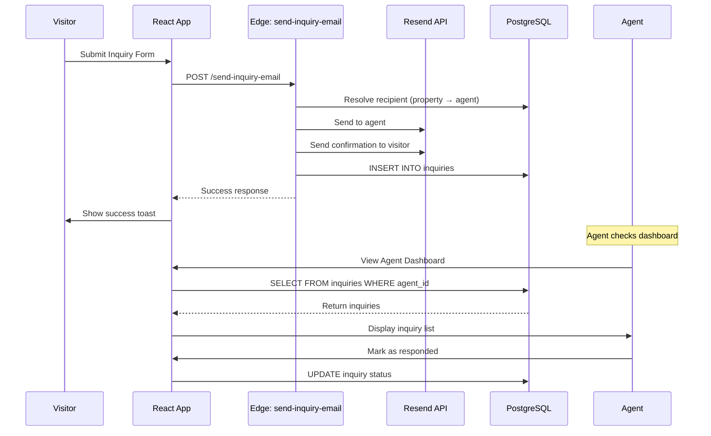
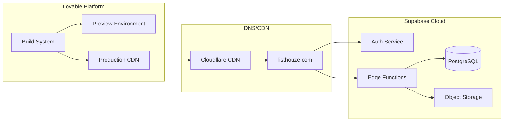
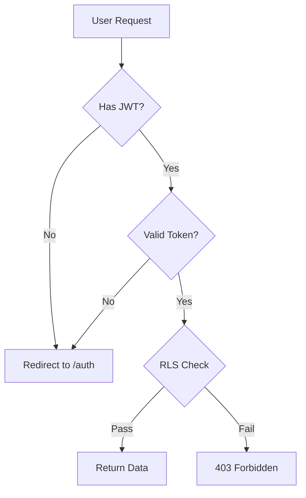

# ListHouze System Architecture

**Version:** 1.0  
**Last Updated:** December 31, 2024

---

## High-Level Architecture



---

## Technology Stack

| Layer | Technology | Version |
|-------|------------|---------|
| Frontend | React | 18.3.1 |
| Build Tool | Vite | Latest |
| Styling | Tailwind CSS | 3.x |
| UI Components | shadcn/ui + Radix | Latest |
| State Management | TanStack Query | 5.83.0 |
| Routing | React Router | 6.30.1 |
| Animation | Framer Motion | 12.23.26 |
| Forms | React Hook Form + Zod | 7.61.1 / 3.25.76 |
| Backend | Supabase | 2.89.0 |
| Database | PostgreSQL | 14.1 |
| Edge Functions | Deno | Latest |
| Payments | Stripe | 14.21.0 |
| Email | Resend | API v1 |
| Maps | Google Maps | 3.58.1 |

---

## Data Flow Diagrams

### 1. User Signup → Profile Creation → Role Gating



### 2. Listing Creation → Publish → Public Display



### 3. Inquiry Flow → Email → Dashboard



---

## Deployment Architecture



### Environment Separation

| Environment | Purpose | URL |
|-------------|---------|-----|
| Preview | Each PR gets a preview | `*.lovable.app` |
| Production | Live site | `listhouze.com` |

### Supabase Project
- Single project with production data
- Edge functions deployed via Lovable Cloud
- Migrations tracked in `supabase/migrations/`

---

## Security Architecture

### Authentication Flow



### Security Boundaries

1. **Frontend**: Public routes vs AuthGuard protected
2. **Database**: RLS policies per table per operation
3. **Edge Functions**: JWT validation + service role escalation
4. **Storage**: Bucket policies with user/org isolation

### Threat Model Highlights

| Threat | Mitigation |
|--------|------------|
| SQL Injection | Supabase SDK parameterized queries |
| XSS | React auto-escaping + CSP headers |
| CSRF | SameSite cookies + CORS headers |
| Privilege Escalation | RLS + security definer functions |
| Data Leakage | Column-level RLS + views |
| Rate Limiting | Edge function limits + DB rate checks |

---

## Key Components

### Frontend Structure

```
src/
├── pages/           # Route components (80+ pages)
│   ├── admin/       # Super admin portal
│   ├── agent/       # Agent dashboard
│   ├── owner/       # Agency owner dashboard
│   ├── customer/    # Buyer/renter dashboard
│   ├── seller/      # Private lister dashboard
│   ├── mortgage/    # Broker portal
│   └── ...          # Public pages
├── components/      # Reusable UI (30+ directories)
├── hooks/           # Custom hooks (38 files)
├── integrations/    # Supabase client + types
└── lib/             # Utilities
```

### Edge Functions

| Function | Purpose |
|----------|---------|
| `billing-start-checkout` | Create Stripe checkout session |
| `billing-webhook` | Handle Stripe events |
| `send-inquiry-email` | Route inquiries to recipients |
| `get-agent-contact` | Rate-limited contact reveal |
| `vaultre-sync` | Sync properties from VaultRE |
| `abn-lookup` | Validate AU business numbers |
| `nzbn-lookup` | Validate NZ business numbers |

### Storage Buckets

| Bucket | Public | Purpose |
|--------|--------|---------|
| `property-images` | Yes | Listing photos |
| `agent-photos` | Yes | Agent headshots |
| `avatars` | Yes | User profile photos |
| `organization-assets` | Yes | Agency logos/banners |
| `sold-property-images` | Yes | Historical sold photos |
| `broker-verification` | No | ID documents |
| `mortgage-lead-docs` | No | Lead attachments |

---

## Performance Considerations

### Database Indexes

Current indexes on frequently queried columns:
- `properties`: status, listing_category, organization_id
- `agents`: is_active, verification_status, slug
- `inquiries`: agent_id, property_id, status

### Recommended Additions

```sql
-- Geospatial search
CREATE INDEX idx_properties_geo ON properties (latitude, longitude);

-- Text search
CREATE INDEX idx_properties_suburb ON properties (suburb);
CREATE INDEX idx_agents_service_areas ON agents USING GIN (service_areas);
```

### Caching Strategy

- TanStack Query: 60s staleTime, 5min gcTime
- Static assets: CDN cached
- Database: Supabase connection pooling

---

## Scalability Notes

### Current Limits
- Supabase Free/Pro tier limits apply
- Edge function cold starts ~100-500ms
- Realtime connections limited by plan

### Scaling Path
1. **Database**: Upgrade Supabase plan for more connections
2. **Storage**: CDN for images already in place
3. **Edge Functions**: Scale automatically
4. **Search**: Consider Supabase Full-Text Search or Algolia

---

*Document generated: December 31, 2024*
