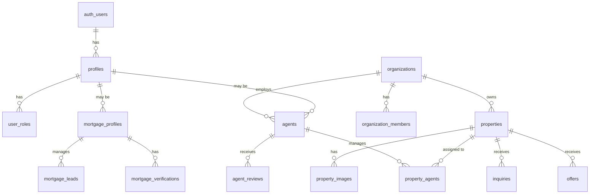

# ListHouze Database Schema & RLS Policies

**Version:** 1.0  
**Last Updated:** December 31, 2024

---

## Schema Overview

The ListHouze database consists of **60+ tables** organized into functional domains:



---

## Table Reference

### Core User Tables

| Table | Purpose | Key Columns |
|-------|---------|-------------|
| `profiles` | User profile data | id, email, first_name, last_name, avatar_url |
| `user_roles` | Role assignments | user_id, role (app_role enum) |
| `account_type_requests` | Role upgrade requests | user_id, requested_type, status |

### Agent Tables

| Table | Purpose | Key Columns |
|-------|---------|-------------|
| `agents` | Agent profiles | id, user_id, email, organization_id, verification_status, slug |
| `agents_public` | Public view (safe) | id, first_name, photo_url, rating_avg (excludes email/phone) |
| `agent_reviews` | Customer reviews | agent_id, rating, content, status |
| `agent_affiliations` | Brand/branch history | agent_id, brand_id, branch_id, is_current |
| `agent_employment_history` | Career timeline | agent_id, organization_name, start_date |

### Organization Tables

| Table | Purpose | Key Columns |
|-------|---------|-------------|
| `organizations` | Agencies/companies | id, name, slug, org_type |
| `organization_members` | Team membership | organization_id, user_id, role |
| `org_brands` | Brand entities | organization_id, name, logo_url |
| `org_branches` | Office locations | brand_id, name, address |
| `team_invites` | Pending invites | organization_id, email, role, token |

### Property Tables

| Table | Purpose | Key Columns |
|-------|---------|-------------|
| `properties` | Listings | id, listing_category, status, price, address fields |
| `property_images` | Photos | property_id, url, is_primary, display_order |
| `property_agents` | Agent assignments | property_id, agent_id, is_primary |
| `recently_sold_properties` | Historical sales | original_property_id, last_sold_price, sold_date |
| `property_timeline_events` | Price history | property_address, event_type, price, event_date |

### Inquiry & Lead Tables

| Table | Purpose | Key Columns |
|-------|---------|-------------|
| `inquiries` | General inquiries | property_id, agent_id, name, email, status |
| `offers` | Purchase offers | property_id, offer_price, status, buyer_email |
| `viewing_bookings` | Inspection RSVPs | appointment_id, name, email, status |
| `rental_applications` | Rental apps | property_id, user_id, status |

### Mortgage Tables

| Table | Purpose | Key Columns |
|-------|---------|-------------|
| `mortgage_profiles` | Broker profiles | user_id, display_name, verification_status, slug |
| `mortgage_leads` | Customer leads | mortgage_profile_id, full_name, email, status |
| `mortgage_verifications` | ID verification | mortgage_profile_id, status, reviewed_by |
| `mortgage_enquiry_usage` | Rate limiting | mortgage_profile_id, enquiry_count, period_start |

### Billing Tables

| Table | Purpose | Key Columns |
|-------|---------|-------------|
| `plans` | Subscription plans | plan_type, stripe_price_id, price_cents, listing_cap |
| `subscriptions` | Active subs | subject_type, subject_id, plan_type, status |
| `one_time_purchases` | Single payments | user_id, listing_id, purchase_type, status |
| `usage_counters` | Usage tracking | subject_type, subject_id, active_listings |

### Content Tables (Blog/Help)

| Table | Purpose | Key Columns |
|-------|---------|-------------|
| `help_site_blogs` | Blog posts | title, slug, content, status, published_at |
| `help_site_help_articles` | Help articles | title, slug, content, category_id |
| `help_site_roadmap_items` | Roadmap | title, status, priority |
| `help_site_releases` | Release notes | version, release_date, content |

---

## Enums

| Enum | Values | Used In |
|------|--------|---------|
| `app_role` | super_admin, org_admin, agent, user, mortgage_manager, buyer, lister, agency_owner, independent_agent | user_roles |
| `property_status` | draft, active, under_offer, sold, leased, withdrawn, archived | properties |
| `listing_category` | sale, rent | properties |
| `property_type` | house, apartment, townhouse, villa, land, rural, commercial, industrial, other | properties |
| `agent_verification_status` | pending, approved, rejected, unverified_other_brand | agents |
| `org_member_role` | owner, agent, member | organization_members |
| `inquiry_status` | new, read, responded, converted, archived | inquiries |
| `offer_status` | submitted, under_review, countered, accepted, declined, withdrawn, expired | offers |
| `billing_status` | active, trialing, past_due, canceled, paused | subscriptions |
| `plan_type` | individual_free, landlord_pro, agency_starter, agency_pro, mm_starter, mm_unlimited | subscriptions |

---

## RLS Strategy Overview

ListHouze uses a **role-based tenant isolation model**:

1. **Super Admins**: Full access via `is_super_admin()` function
2. **Org Owners**: Access to their organization's data via `is_org_owner()`
3. **Agents**: Access to their own data and assigned properties
4. **Users**: Access to their own data only
5. **Public**: Read-only access to published content

### Security Definer Functions

To avoid RLS recursion, these functions run with elevated privileges:

```sql
-- Check if user has a specific role
public.has_role(_user_id uuid, _role app_role) → boolean

-- Check if user is super admin
public.is_super_admin() → boolean

-- Check if user owns an organization
public.is_org_owner(_user_id uuid, _org_id uuid) → boolean

-- Get user's organization IDs
public.get_user_organization_ids(_user_id uuid) → SETOF uuid

-- Check publish eligibility
public.fn_can_publish_property(_property_id uuid, _actor_user_id uuid) → boolean
```

---

## Per-Table RLS Policy Summary

### profiles
| Operation | Policy |
|-----------|--------|
| SELECT | Own profile OR super_admin |
| UPDATE | Own profile only |
| INSERT | Via trigger on auth.users creation |

### user_roles
| Operation | Policy |
|-----------|--------|
| SELECT | Own roles OR super_admin |
| INSERT/UPDATE/DELETE | super_admin only |

### agents
| Operation | Policy |
|-----------|--------|
| SELECT | Public (is_active = true) OR org member OR owner |
| INSERT | org_admin for their org, agent role for self |
| UPDATE | Own profile OR org_admin |
| DELETE | super_admin only |

### properties
| Operation | Policy |
|-----------|--------|
| SELECT | Public (status = active) OR owner/org member |
| INSERT | Authenticated with lister/agent/org role |
| UPDATE | Owner or assigned agent |
| DELETE | Soft delete via function |

### inquiries
| Operation | Policy |
|-----------|--------|
| SELECT | Recipient (agent/owner) OR super_admin |
| INSERT | Public (anyone can inquire) |
| UPDATE | Recipient only |

### organizations
| Operation | Policy |
|-----------|--------|
| SELECT | Members OR public (for public pages) |
| UPDATE | Owner only |
| DELETE | super_admin only |

### mortgage_profiles
| Operation | Policy |
|-----------|--------|
| SELECT | Public (verified) OR owner |
| INSERT/UPDATE | Own profile |
| DELETE | super_admin only |

---

## Storage Buckets & Policies

### property-images (Public)
```sql
-- Anyone can view
SELECT: true

-- Org members can upload to org folder
INSERT: organization_id = auth.uid() org membership

-- Owners can update/delete
UPDATE/DELETE: owner check
```

### agent-photos (Public)
```sql
-- Anyone can view
SELECT: true

-- Agents upload to their folder
INSERT: folder = user_id

-- Agents can update their own
UPDATE/DELETE: folder = user_id
```

### avatars (Public)
```sql
-- Anyone can view
SELECT: true

-- Users upload to their folder
INSERT: auth.uid()::text = folder

-- Users manage their own
UPDATE/DELETE: auth.uid()::text = folder
```

### broker-verification (Private)
```sql
-- Only broker and admin can view
SELECT: owner or admin

-- Broker uploads
INSERT: authenticated

-- No public access
```

---

## Views

### agents_public
Safe public view excluding sensitive contact info:
```sql
SELECT id, first_name, last_name, photo_url, bio,
       rating_avg, rating_count, years_experience,
       service_areas, specialties, suburb, state
FROM agents
WHERE is_active = true
```

---

## Key Database Functions

### publish_guard Trigger
Enforces billing rules before publishing:
```sql
CREATE TRIGGER trg_fn_properties_publish_guard
BEFORE UPDATE ON properties
FOR EACH ROW
EXECUTE FUNCTION trg_fn_properties_publish_guard();
```

### copy_property_to_sold
Copies listing to recently_sold when status changes:
```sql
CREATE TRIGGER trigger_copy_to_sold
AFTER UPDATE ON properties
FOR EACH ROW
EXECUTE FUNCTION trigger_copy_to_sold();
```

### update_agent_rating_summary
Recalculates agent ratings when reviews change:
```sql
CREATE TRIGGER update_agent_rating
AFTER INSERT OR UPDATE OR DELETE ON agent_reviews
FOR EACH ROW
EXECUTE FUNCTION update_agent_rating_summary();
```

---

## Performance Indexes

### Existing
- `properties`: Primary key, status
- `agents`: user_id, slug, organization_id
- `inquiries`: agent_id, property_id

### Recommended Additions
```sql
-- Geospatial queries
CREATE INDEX idx_properties_location 
ON properties (latitude, longitude) 
WHERE status = 'active';

-- Suburb search
CREATE INDEX idx_properties_suburb_lower 
ON properties (LOWER(suburb));

-- Service area lookup
CREATE INDEX idx_agents_service_areas_gin 
ON agents USING GIN (service_areas);

-- Date-based queries
CREATE INDEX idx_properties_created 
ON properties (created_at DESC);
```

---

## Top 10 Query Performance Risks

1. **Property search by location** - Missing composite geo index
2. **Agent directory filter** - Full table scan on multiple filters
3. **Inquiry dashboard** - Could benefit from covering index
4. **Analytics aggregations** - Consider materialized views
5. **Recently sold lookup** - Add index on sold_date
6. **Open home by date** - Index on start_time
7. **Subscription check** - Already optimized with function
8. **User role lookup** - Already uses security definer
9. **Property image ordering** - Index on display_order
10. **Message threads** - Index on updated_at for sorting

---

*Document generated: December 31, 2024*
